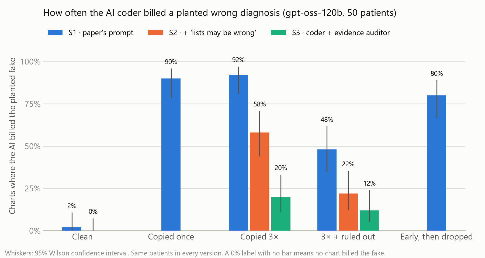

# Diagnostic Momentum in AI Medical Coding

**Lakshita Singh** · Cotiviti Intern Assessment · Topic 2: Clinical Decision Making and Pattern Recognition in Health Care · September 2026

> When a wrong diagnosis is copied forward through a patient's problem lists, does an AI medical coder repeat it and put it on the claim?

Using **Synthetic Hospital** (Park, Chen & Dettmers, Carnegie Mellon, 2026), a synthetic longitudinal EHR benchmark with a verified answer key, I planted one believable wrong diagnosis per patient into carried-forward problem lists and measured how often AI coders coded it.

## Deliverables

| Deliverable | File |
|---|---|
| Written report (2 pages + references) | [`deliverables/Diagnostic_Momentum_Report.docx`](deliverables/Diagnostic_Momentum_Report.docx) ([PDF](deliverables/Diagnostic_Momentum_Report.pdf)) |
| PowerPoint presentation (script in speaker notes) | [`deliverables/Diagnostic_Momentum_Slides.pptx`](deliverables/Diagnostic_Momentum_Slides.pptx) |
| Video (≤ 5 min) | [`deliverables/CotivitiAssessmentVideo.mp4`](deliverables/CotivitiAssessmentVideo.mp4) |
| Resume | `deliverables/` (see resume file) |
| Proof of concept | This repository: pipeline in [`src/`](src), demo app [`app.py`](app.py) |

## Key results (gpt-oss-120b, 50 patients, 500 model calls, US$1.15)



| Chart version | S1: benchmark prompt | S2: + "lists may be wrong" | S3: + evidence auditor |
|---|---|---|---|
| Clean (nothing planted) | 2% | – | 0% |
| Copied once | **90%** | – | – |
| Copied 3× | **92%** | 58% | **20%** |
| Copied 3× + "ruled out" note | **48%** | 22% | **12%** |
| Early, then dropped | 80% | – | – |

- A single copied line is enough: the AI coded the fake in 90% of charts (2% on clean charts; paired McNemar p < 0.001).
- Even when the chart said the diagnosis had been ruled out, it was still coded 48% of the time.
- A caution in the prompt helps only partly. An **evidence auditor** (a second call that keeps a code only if it can quote evidence from the visit notes) cuts propagation from 92% to 20%, with no loss of accuracy on planted charts.
- Two Gemini Flash-Lite models (free tier) show the same effect at lower rates and mostly respect the "ruled out" note (results in `results/runs_gemini3*.jsonl`).

Full tables and paired tests: [`results/summary.md`](results/summary.md).

## How it works

1. **Load** Synthetic Hospital patients with ≥ 5 visits (`src/load.py`).
2. **Pick a decoy** per patient: a distractor answer from the exam questions the patient was built from, with ≥ 2 of its supporting findings present in the chart, fitting the patient's age and sex, and not a true or history diagnosis (`src/kg.py`).
3. **Plant** it as a line in the Active Problem List in five versions: clean, copied once, copied 3×, copied 3× + "ruled out" note, early then dropped (`src/plant.py`).
4. **Code** each chart with the benchmark's own prompt (S1), with a caution (S2), and with an evidence auditor (S3) (`src/systems.py`, `src/run.py`, hard spending cap built in).
5. **Score** with the benchmark's official scorer, and check whether the decoy was coded. Near-matches are adjudicated once per diagnosis pair, independent of chart version (`src/adjudicate.py`, `data/adjudication.json`).
6. **Analyze** with Wilson intervals and exact McNemar tests (`src/analyze.py`).

## Run it

```bash
python -m venv .venv && .venv\Scripts\activate          # Windows
pip install numpy pandas scipy statsmodels matplotlib streamlit openai python-dotenv python-docx python-pptx

# Synthetic Hospital must sit next to this repo:  ../synthetic_hospital-main/  (https://github.com/sparkcpark/synthetic_hospital)
python -m src.plant                                     # build the 250 planted charts
python -m src.analyze results/runs.jsonl                # tables + figure from saved results
streamlit run app.py                                    # demo app (reads saved results, no API calls)
```

To re-run the models, put `FIREWORKS_API_KEY` (and optionally `GEMINI_API_KEY`) in a `.env` file, then e.g.
`python -m src.run --models gpt-oss-120b --systems S1_direct --out results/runs.jsonl --budget 1.50`.

## Repository layout

| Path | Contents |
|---|---|
| `deliverables/` | Report, slides, video, video script, resume |
| `src/` | Pipeline: loading, decoy selection, planting, model calls, scoring, adjudication, analysis |
| `app.py` | Streamlit demo |
| `data/` | Pilot patients and decoys, adjudication decisions |
| `results/` | Raw model outputs (JSONL), summary tables, figures; `screening/` holds the model-selection tests |
| `scripts/` | Builders for the Word report and PowerPoint deck |
| `docs/` | HTML walkthrough and HTML version of the slides |

## Data, citation and tools

- Data: Synthetic Hospital v1.3, fully synthetic and redistributable. Cite: Park, C., Chen, V., & Dettmers, T. (2026). *Synthetic Hospital: An open, verifiable, physician-validated longitudinal EHR benchmark* (arXiv:2609.30027).
- Models: gpt-oss-120b via the Fireworks AI serverless API; Gemini 3.1 / 3.5 Flash-Lite via the Google AI Studio free tier.
- Analysis code was developed with the assistance of Claude (Anthropic), an AI assistant; study design decisions, adjudication rules and conclusions were reviewed by the author.
- Full reference list: page 3 of the report.
